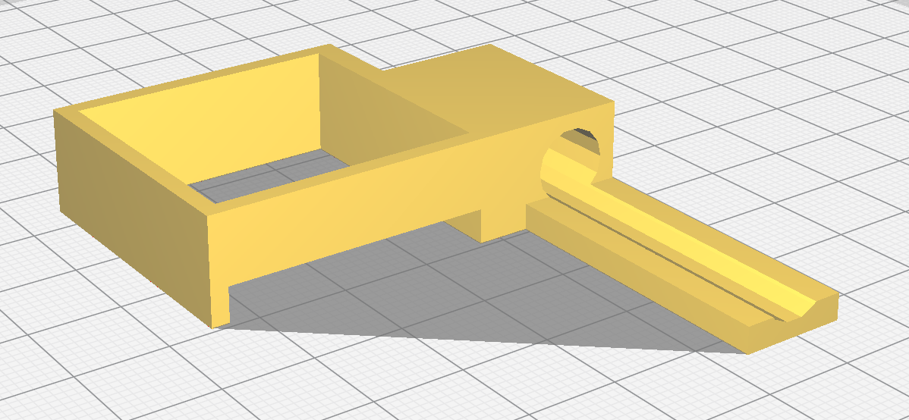
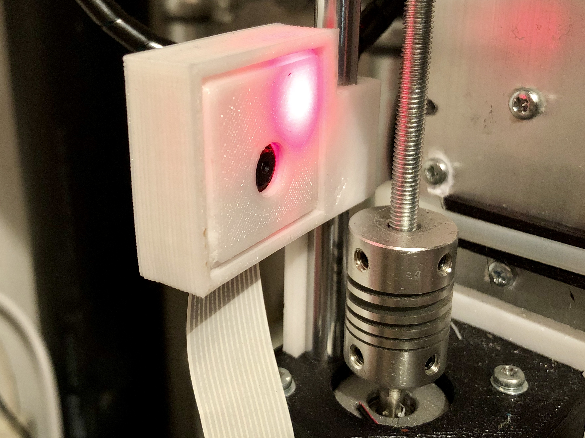

# Prusa I3 Camera Holder
I have a clone off the [Prusa I3](https://www.prusaprinters.org/prusa-i3/) 3D printer. This part allows to add the [Raspberry PI Camera](https://www.raspberrypi.org/products/camera-module-v2/) to the printer to capture timelapse videos of your print. Print [this](https://www.thingiverse.com/thing:267265) case for the Raspberry PI camera and then mount it using my part.

## Images

## Disclaimer
Trademark "Prusa" belongs to its respective owner and is used here for reference only.
