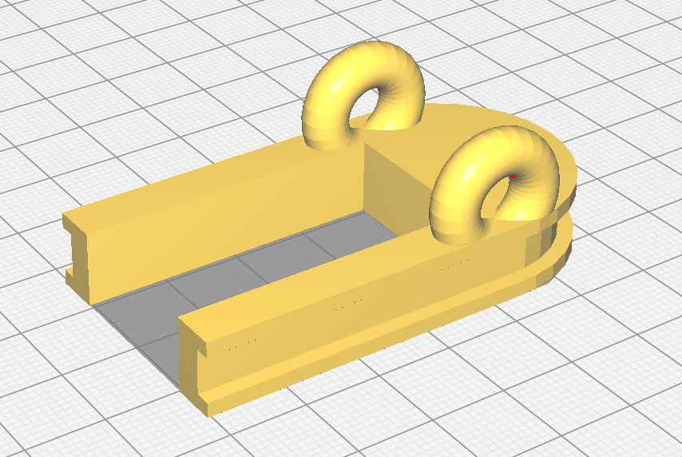
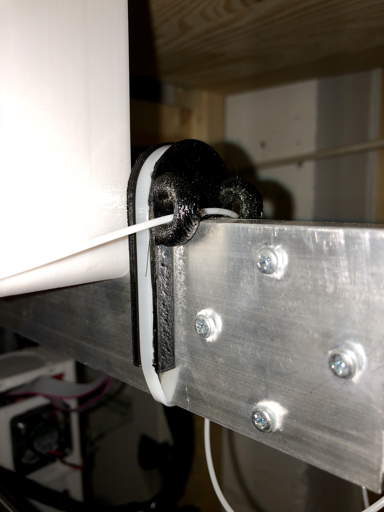

# Prusa I3 Filament Guide
I have a clone off the [Prusa I3](https://www.prusaprinters.org/prusa-i3/) 3D printer. This part allows to add a filemant guide to the printer.

## Images

## Disclaimer
Trademark "Prusa" belongs to its respective owner and is used here for reference only.
