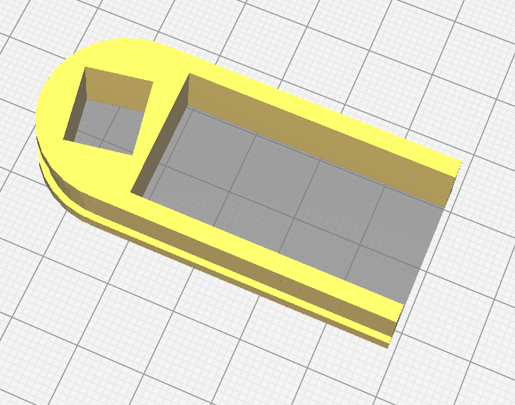
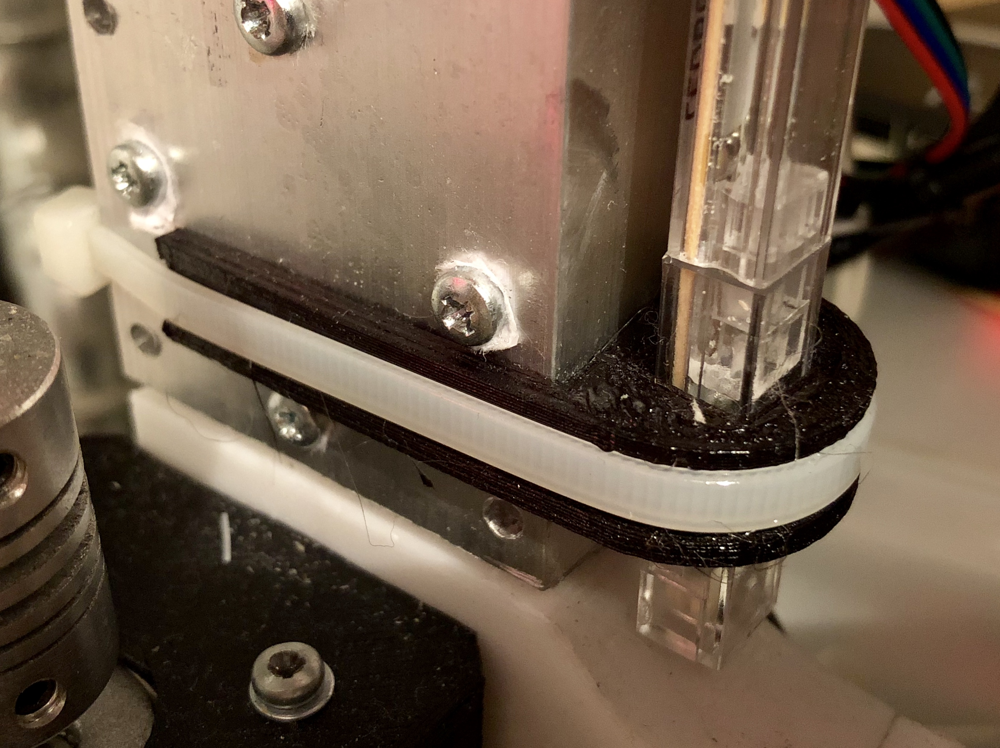

# Prusa I3 LED Holder
I have a clone off the [Prusa I3](https://www.prusaprinters.org/prusa-i3/) 3D printer. This part allows to add an IKEA LED strip to the printer to light the print to allow capturing timelapse videos of your print.

## Images

## Disclaimer
Trademark "Prusa" belongs to its respective owner and is used here for reference only.
