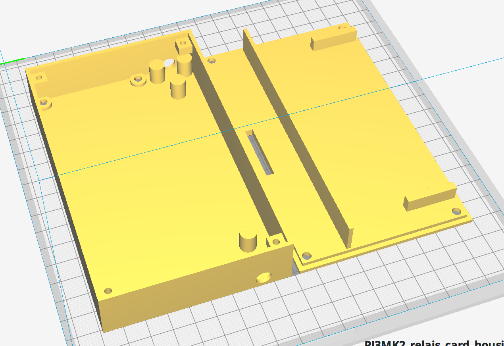

# Relais Card Housing
This is a housing for an 8-Relais card that can be controlled via the Raspberry PI. I use it to let [OctoPrint](https://octoprint.org) control the power supply of the 3D printer.

Find more information here:
* [Raspberry Pi: Relais-Schalter per GPIO steuern](https://tutorials-raspberrypi.de/raspberry-pi-relais-schalter-steuern/)
* [GPIO beim Raspberry Pi per Kommando ansteuern](http://www.netzmafia.de/skripten/hardware/RasPi/RasPi_GPIO_Shell.html)
* [OctoPrint PSU Control](https://github.com/kantlivelong/OctoPrint-PSUControl)
* [8-Kanal Relais Modul 5V/230V Optokoppler 8-Channel Relay Arduino Raspberry Pi](https://smile.amazon.de/dp/B00AEIDWXK/ref=pe_3044161_189395811_TE_3p_dp_1)

## Images

## Disclaimer
230~V are dangerous. Please only fiddle around with a relais card if you know exactly what you are doing.
